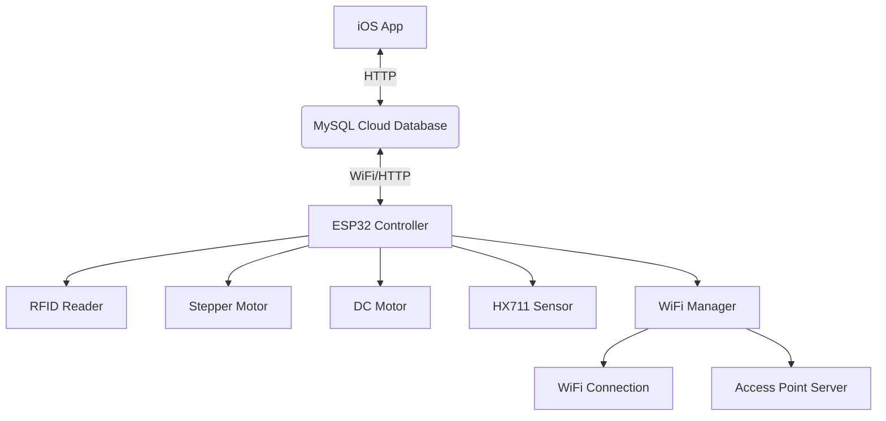

# RFID Smart Pet Feeder 🐾

**An automated feeding system featuring RFID-based pet authentication, precise portion management through controlled food dispensing mechanisms, and real-time monitoring capabilities via WiFi-connected sensors. The project combines industrial-grade reliability with consumer-friendly operation, offering scheduled feedings, access control for multi-pet households, and remote status checks through its dedicated mobile application.**

Designed for pet owners who want to:
✔️ Prevent food theft by other animals  
✔️ Maintain consistent feeding routines  
✔️ Monitor consumption while away  
✔️ Customize portions for each pet

## 🌟 Key Features

### Hardware (ESP32 Firmware)
- **RFID Access** - Only registered pet tags activate the trap door
- **Precision Food Dispensing** - Controlls a DC motor for food release and a stepper motor for the trap door
- **Real-time Weight Monitoring** - Weight module sensor tracks bowl food levels
- **Dual Connectivity** - WiFi connection for cloud sync + AP mode for wifi configuration
- **Automated Scheduling** - Time-based feeding configurations from an IOS application
  
### iOS Application
- **Multi-Feeder Dashboard** - Manage multiple devices from one interface
- **Feeding Configurations** - Intuitive scheduling interface with portion control
- **Live Monitoring** - Real-time food level updates and feeding alerts
- **Event History** - Review past feeding sessions and trap access attempts

## 🛠 System Architecture

## 📦 Hardware Setup

### Required Components
| Component | Model | Purpose | Wiring |
|-----------|-------|---------|---------|
| Microcontroller | ESP32 | System brain | [View](https://raw.githubusercontent.com/oanamacsim/RFIDSmartPetFeeder/main/FeederESP32Firmware/images/PowerWiringDiagramAllSensors.png) |
| RFID Reader | RDM6300 | Pet tag authentication | [View](https://raw.githubusercontent.com/oanamacsim/RFIDSmartPetFeeder/main/FeederESP32Firmware/images/WiringDCMotor.png) |
| DC Motor | 12V DC Motor | Food dispensing mechanism | [View](https://raw.githubusercontent.com/oanamacsim/RFIDSmartPetFeeder/main/FeederESP32Firmware/images/WiringDCMotor.png) |
| Stepper Motor | 12V 28BYJ-48 | Trap oppening mechanism | [View](https://raw.githubusercontent.com/oanamacsim/RFIDSmartPetFeeder/main/FeederESP32Firmware/images/WiringStepperMotor.png) |
| Sensor | HX711 | Weight measurement | [View](https://raw.githubusercontent.com/oanamacsim/RFIDSmartPetFeeder/main/FeederESP32Firmware/images/WiringWeightModule.png) |
| Power | 9-12V Supply | System power | [View](https://raw.githubusercontent.com/oanamacsim/RFIDSmartPetFeeder/main/FeederESP32Firmware/images/PowerWiringDiagramAllSensors.png) |

## 📱 Mobile App Preview

**Feeder Dashboard:**

  

**Live Monitoring:**  

**Schedule a Feed Config:**  

  

## 🚀 Getting Started

### Hardware Setup (ESP32 Firmware)

🔧 **[Hardware Guide →](FeederESP32Firmware#setup-instructions)**  

- Flashing firmware instructions  
- Component wiring diagrams  
- Sensor calibration  

### Mobile App Setup (iOS)

📱 **[App Setup Guide →](FeederMobileApp#setup-instructions)**
  
**Requirements:**  
- Xcode 13+  
- iOS 15+ device/simulator  

**Covers:**  
- Project configuration  
- Build & run instructions  
- Feeder pairing  

## 🤝 Contributing
Feel free to explore the code and reach out with any questions or feedback!
